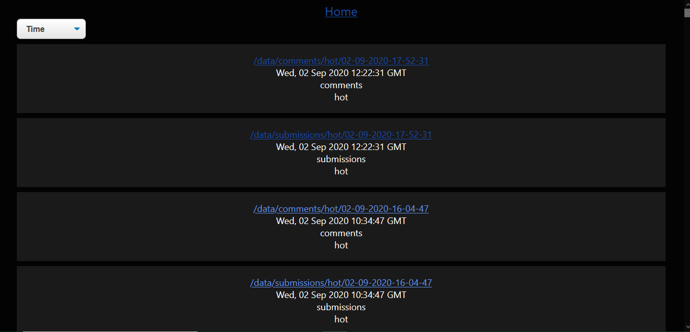
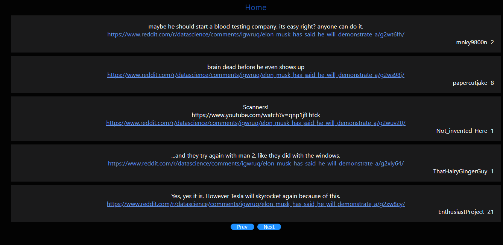

# DisplayReddit

DisplayReddit is a way to to display data extracted from [RedditScrapy](https://github.com/M-e-r-c-u-r-y/RedditScrapy).

The frontend is written using React and the backend with fastapi.

## Sample UI images

### `npm start`
Starts the frontend

### `uvicorn main:app --reload`
Starts the backend.
Ensure the files generated by [RedditScrapy](https://github.com/M-e-r-c-u-r-y/RedditScrapy) are stored in the output folder whose path is set in the `OUTPUT_PATH` environment variable

## Contributing
Pull requests are welcome. For major changes, please open an issue first to discuss what you would like to change.

## License
[MIT](https://choosealicense.com/licenses/mit/)