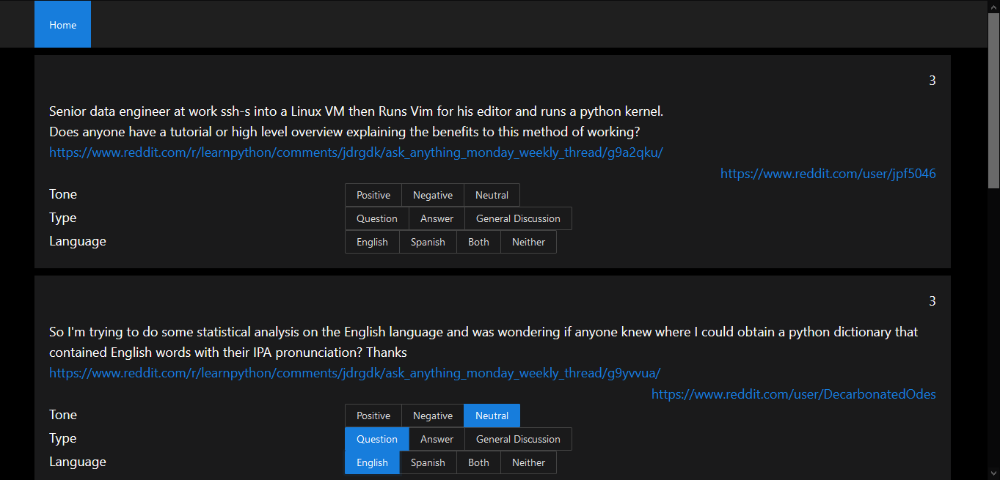

# DisplayReddit

DisplayReddit is a way to to display data extracted from [RedditScrapy](https://github.com/M-e-r-c-u-r-y/RedditScrapy).

The frontend is written using React and the backend with fastapi.

## Sample UI images

## To use docker to start the app
Navigate to the root of this repo after cloning onto your machine and run the following command
### `docker-compose up -d` starts the app
### `docker-compose down` stops the app

## To run directly on your machine

## To start frontend
Navigate to the frontend folder and run the following commands 
### `npm install` installs the dependencies
### `npm start` starts the server
Navigate to the backend folder and run the following commands
## To start backend
### `pip3 install -r requirements.txt` installs the dependencies
### `uvicorn main:app --reload` starts the server

Ensure the files generated by [RedditScrapy](https://github.com/M-e-r-c-u-r-y/RedditScrapy) are stored in the output folder whose path is set in the `OUTPUT_PATH` environment variable(Assumed to be in same level as this repo when cloned to your machine)

### http://localhost:8000 is where the backend can be accessed

### http://localhost:3000 is where the frontend can be accessed

## Contributing
Pull requests are welcome. For major changes, please open an issue first to discuss what you would like to change.

## License
[MIT](https://choosealicense.com/licenses/mit/)